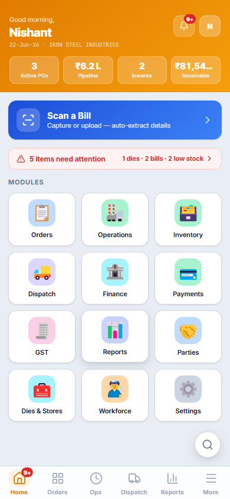
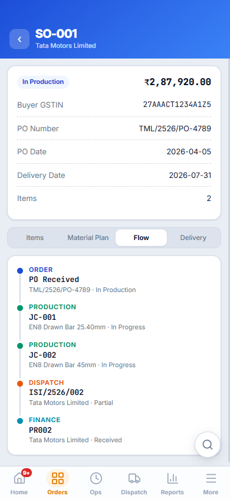
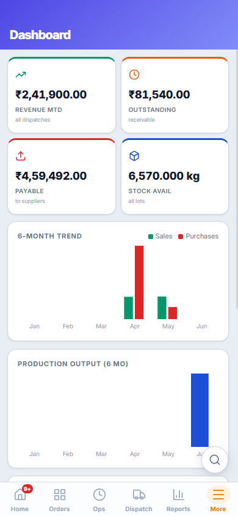
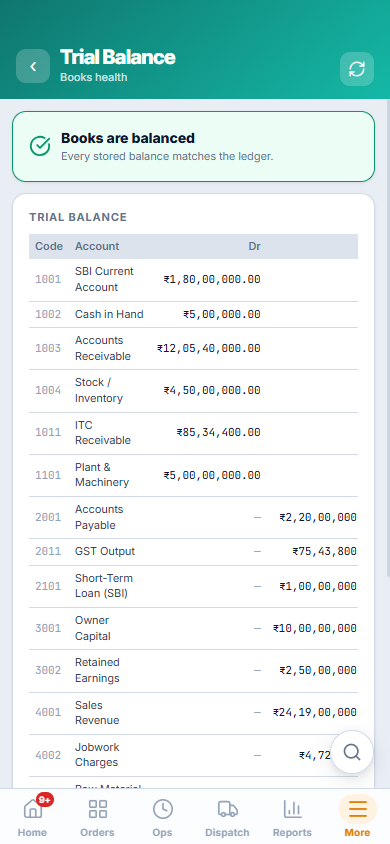
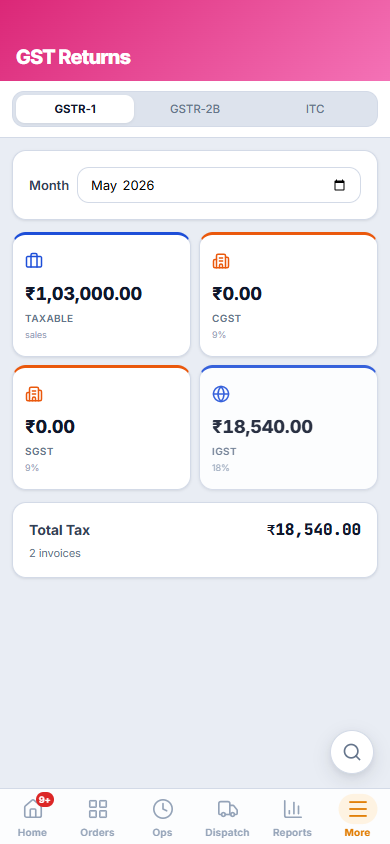
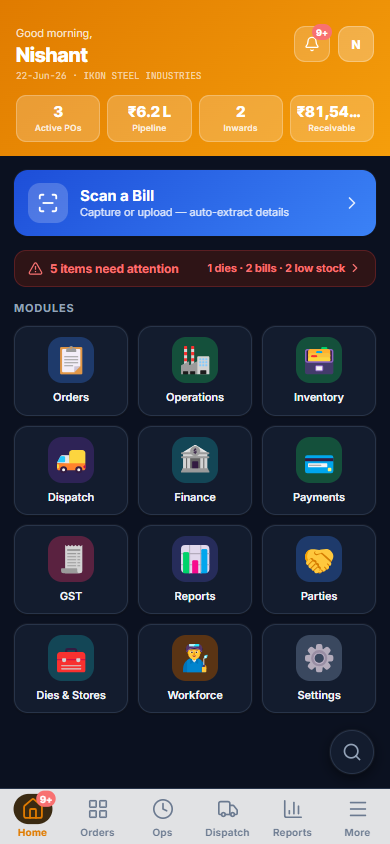

# Steel ERP — Product & Engineering Case Study

> **A mobile-first ERP that digitized a steel round-bar manufacturing MSME** — taken from paper,
> registers, and WhatsApp to a beyond-MVP, financially-correct, auditable Android app. Scoped, planned,
> prioritized, built, and shipped **end-to-end by one person acting as both Product Manager and
> Developer** (directing an AI coding agent as a force-multiplier).

🌐 **Live site:** https://nishantpatel9671.github.io/steel-erp-case-study/ &nbsp;·&nbsp;
📄 **Start with the** **[Case Study](08-product-docs/CASE-STUDY.md)**


---

## Executive summary

A small/medium steel manufacturer runs **two business models in one shop** — buying raw bars, drawing
them into finished bright bars and selling them (**Purchase–Sale**), and processing customers' own
material for a fee (**Job-Work**). It ran entirely on paper and WhatsApp, with no single source of
truth, error-prone GST maths, and no audit trail.

**Steel ERP** replaces all of that with one internal Android app covering the full **order-to-cash**
chain — sales orders, procurement, multi-truck inward, draw-bench production, dies & stores, dispatch,
GST invoicing, double-entry finance, and reporting — with exact money/tax maths enforced by a real
backend.

I owned it across both hats:

- **Product** — discovery, requirements (PRD/BRD), roadmap, prioritization, stakeholder management,
  KPI/governance, and release gating.
- **Engineering** — architecture, database & security (Row-Level Security), CI/CD, testing, and
  directing an AI coding agent under my spec and review.

---

## By the numbers

| Metric | Value |
|--------|-------|
| Screens shipped (live backend) | **28** |
| Database migrations applied | **24** (`0001`–`0024`) |
| Server-side Edge Functions | **18** |
| Automated tests | **51** passing |
| Quality gates | lint **0** · TypeScript strict ✓ · tests ✓ · build ✓ |
| Finance integrity | Double-entry ledger, **`verify_ledger()` balanced** |
| Release readiness | Signed-APK CI pipeline |
| Monthly run cost | **₹0** (free-tier, no card attached) |

---

## Screenshots

> Live screens with **authentic data** (owners approved showcasing partial real data). Written prose in
> this case study keeps business identifiers anonymized. Full set + captions →
> [`screenshots/`](screenshots/README.md).

<table>
  <tr>
    <td align="center"><br><sub><b>Home</b> — KPIs, alerts, module grid</sub></td>
    <td align="center"><br><sub><b>Document chain</b> — PO → JC → Dispatch → Payment</sub></td>
    <td align="center"><br><sub><b>Dashboard</b> — 6-month trend, WAC value</sub></td>
  </tr>
  <tr>
    <td align="center"><br><sub><b>Trial Balance</b> — "books are balanced"</sub></td>
    <td align="center"><br><sub><b>GST</b> — CGST/SGST/IGST split</sub></td>
    <td align="center"><br><sub><b>Dark mode</b></sub></td>
  </tr>
</table>

---

## Tech stack

`Capacitor 6` · `React 18` · `TypeScript (strict)` · `Vite 6` · `Supabase (Postgres / Auth / RLS /
Storage / Edge Functions)` · `TanStack Query` · `Zustand` · `React Hook Form + Zod` · `Vitest` ·
`GitHub Actions CI`

---

## The documents

| # | Document | What it covers |
|---|----------|----------------|
| 1 | [Product Overview & Target Users](01-product-overview.md) | What the product is, the two business models, six fulfillment scenarios, and who uses it |
| 2 | [My Role & Key Responsibilities](02-role-and-responsibilities.md) | The PM + Developer dual role, with concrete evidence |
| 3 | [Requirements Gathering](03-requirements-gathering.md) | How I gathered and understood requirements ("prototype as contract") |
| 4 | [Requirements → User Stories](04-requirements-to-user-stories.md) | Turning business rules into features, milestones, and tasks with Definition of Done |
| 5 | [Prioritization & Stakeholder Management](05-prioritization-and-stakeholders.md) | MVP cut line, free-first constraint, parked-feature decisions, KPIs |
| 6 | [Challenges & Resolutions](06-challenges-and-resolutions.md) | The hard problems and how I solved them (STAR format) |
| 7 | [Outcome & Business Impact](07-outcome-and-impact.md) | What shipped, the quality bar, and the business value |
| 8 | [Product Documents](08-product-docs/README.md) | The formal artefacts: **PRD · BRD · User Stories · Case Study** |
| 9 | [Showcase Guide](09-showcase-guide.md) | How this repo + website were set up |

---

## Domain in one diagram

```
SALES ORDER (customer PO)
   │  decide fulfillment per line → srcType
   ├─ stock    → ship from finished-goods stock (no production)
   ├─ trade    → buy finished goods → resell
   ├─ produce  → Job Card on a draw bench (internal raw material)
   ├─ procure  → Supplier PO → Inward (1..N trucks) → Raw stock → Job Card → Finished goods
   └─ jobwork  → customer's material in → process → charges-only invoice (no material value)
        │
   DISPATCH (1..N trucks) → GST Invoice → E-Way (>₹50k) → Payment
        │
   Every step posts a balanced double-entry voucher to the ledger.
```

---

*Engineering delivery metrics are traceable to the project's technical changelog and QA reports.
Business prose is anonymized for public sharing; screenshots show authentic, owner-approved data.*
